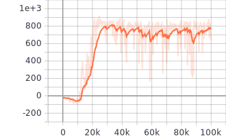

# Yet Another Deep Reinforcement Learning (YADRL)

YADRL is set of implementations of reinforcement learning algorithms. It is
written fully in PyTorch.

## Implemented algorithms


## Installation

Install YADRL package:

```bash
pip install .
```

## CarRacing-v0 experiments:

To execute CarRacing-v0 with SAC agent just run:

```bash
yadrl_runner --config_path experiments/carracing_sac.yaml
```

To execute CarRacing-v0 with SAC-AE agent just run:

```bash
yadrl_runner --config_path experiments/carracing_sac_ae.yaml
```

## Results

CarRacing-v0 SAC



## TODO

Algorithm implementation:

- [ ] PPO
- [ ] TRPO
- [ ] VPG
- [ ] PER
- [ ] APE-X
- [ ] MPO
- [ ] HER
- [ ] IQN and M-IQN
- [ ] FQF

Software improvements:

- [ ] Documentation
- [ ] Distributed training
- [ ] On-policy base agent
